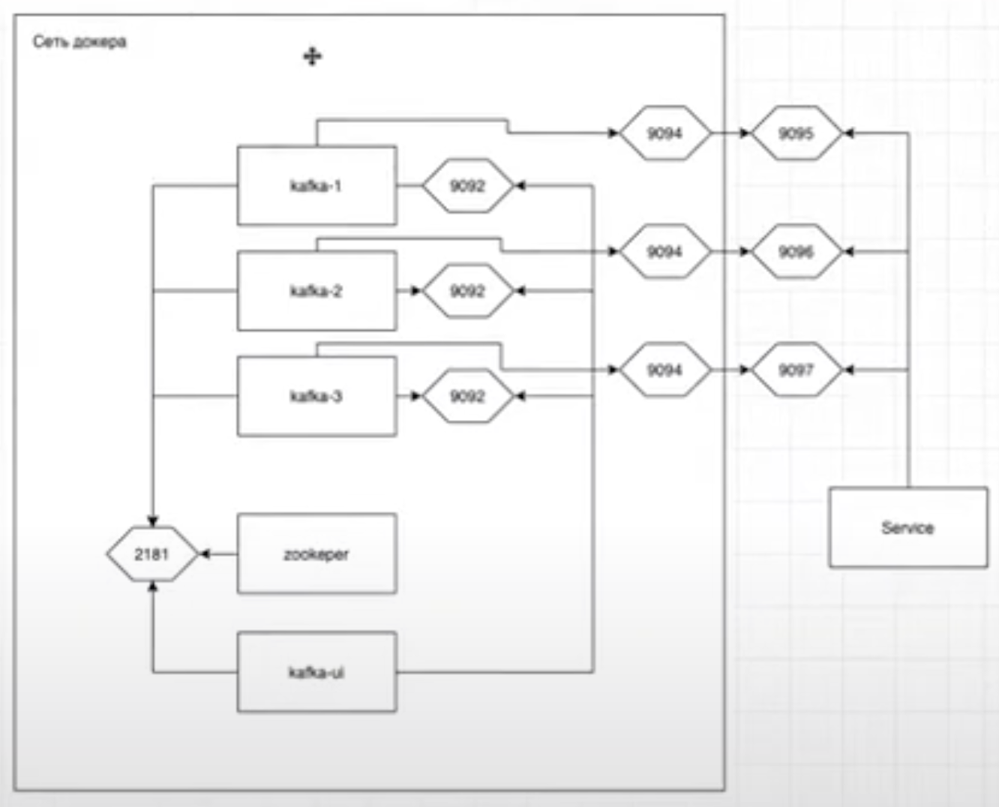
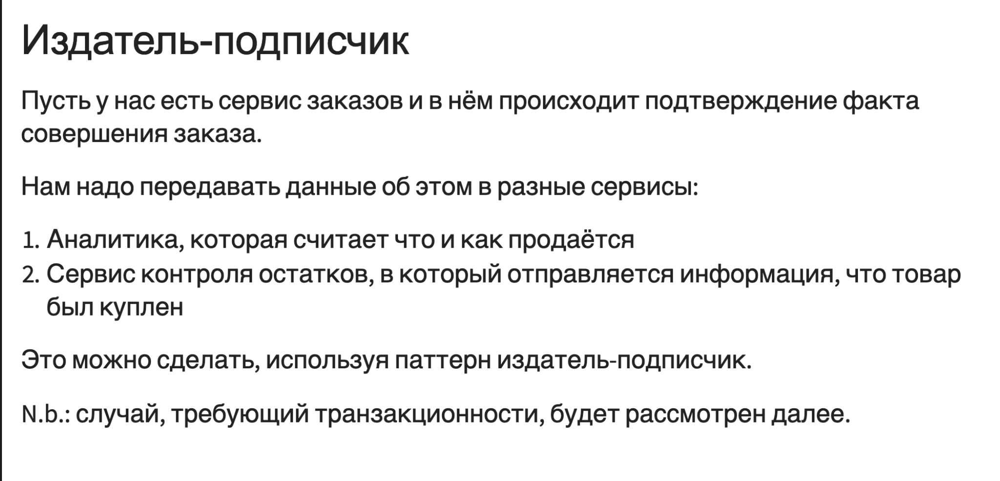

# KAFKA

## Инструкция по запуску

1. Клонируйте репозиторий:
   ```bash
   git clone git@github.com:Chuiko-GIT/tech-experiments.git
   ```
2. Запустите Zookeeper:
   ```bash
   docker-compose up zookeeper -d
   ```
3. Запустите Kafka и Kafka UI:
   ```bash
   docker-compose up kafka-ui kafka-1 kafka-2 kafka-3 -d
   ```
4. Интерфейс Kafka UI будет доступен по адресу:
`http://localhost:8084/`

5. Запустите скрипт для создания топика и записи сообщений продюсером:
   ```bash
   go run publisher-subscriber/order/main.go
   ```
    * Это создаст топик `orders`, и продюсер начнёт писать сообщения в него.
6. Запустите скрипт для создания консьюмера:
   ```bash
   go run publisher-subscriber/analytic/main.go
   ```
    * Это создаст консьюмера, который начнёт считывать сообщения из топика `orders`.

## Схема нашего `docker-compose.yaml`



## Издатель-подписчик

